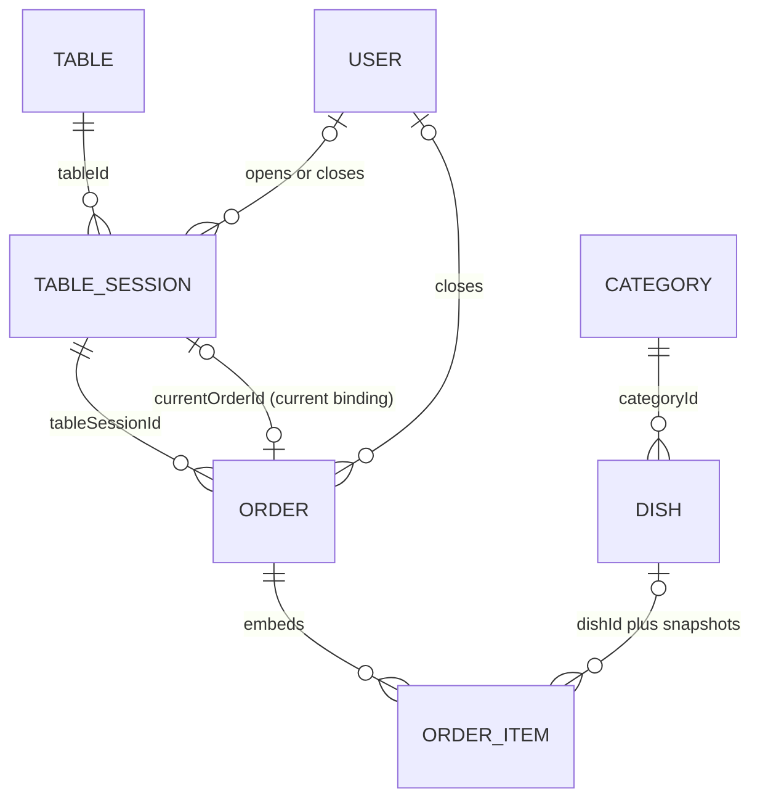
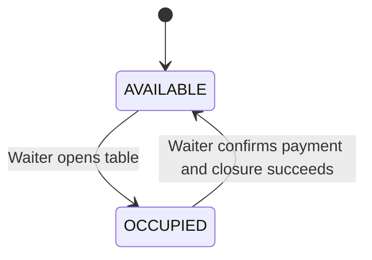
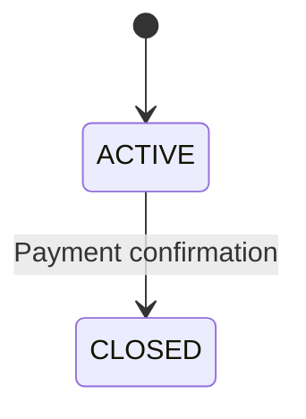
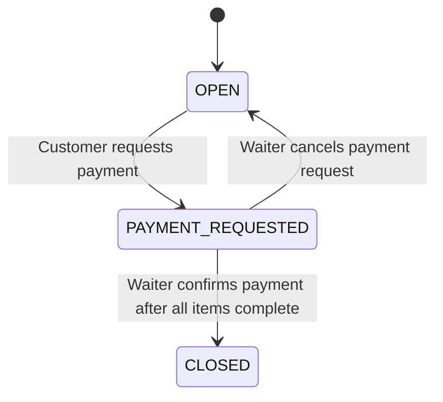
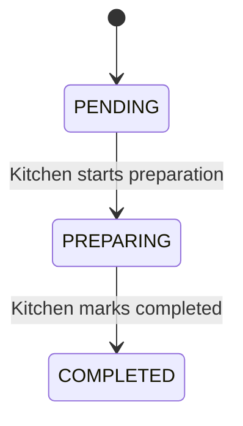

# DineFlow V1.0 Technical Overview

This document describes the implemented DineFlow V1.0 architecture, persisted model, and restaurant lifecycle. It is an overview for maintenance, reporting, and demonstration; the detailed authorization/API reference and risk handling documentation are maintained separately.

## Architecture

DineFlow is a client/server application with a MongoDB persistence layer:

```text
React + TypeScript + Vite client
             |
          HTTP/HTTPS
             |
Express + TypeScript API
             |
          Mongoose
             |
           MongoDB
```

In the accepted production topology, a browser or phone accesses a Render Static Site. The site calls the HTTPS API served by a Render Node Web Service, which persists data in MongoDB Atlas. Deployment credentials, connection strings, and private environment values are intentionally not included here.

### Frontend surfaces

- **Customer**: public table menu, table-session join, cart, and current order.
- **Staff Login**: authentication entry point for staff users.
- **Waiter**: table board, table opening, assisted ordering, payment-request cancellation, and payment confirmation.
- **Kitchen**: queue and strictly ordered item-status actions.
- **Manager**: dashboard, current orders, staff, category, dish, table, QR, history, revenue, and top-dish surfaces.

### Backend organization

The Express application groups routes by domain. Route handlers apply the relevant staff or Customer-session authentication, role authorization where required, and Zod request validation. Controllers delegate business operations to services; services coordinate lifecycle rules and Mongoose models; the models persist data in MongoDB. This is a practical route/controller/service/model organization, not a claim of a separate service deployment or event-driven architecture.

## Responsibility and authority boundaries

- **Customer** is guest/session based. A QR/table route identifies a Table and supports public menu browsing. The current join code establishes Customer-session authority for that active TableSession; a Customer does not receive staff JWT authority.
- **Waiter** is a staff-authenticated operational role for tables, orders, and payment actions.
- **Kitchen** is a staff-authenticated role for the kitchen queue and its allowed item transitions.
- **Manager** is a staff-authenticated administration and reporting role.
- **Server** is authoritative for lifecycle transitions, dish snapshots, integer-VND totals, kitchen item state, payment closure, and reporting data.
- **Client** displays returned state and submits allowed intent. It is not lifecycle authority.

## Data model

### User

Represents a staff identity. Important fields are `name`, unique `username`, unique `email`, `role` (`WAITER`, `KITCHEN`, or `MANAGER`), and `active`. `passwordHash` is persisted internally and is not a public API DTO field. A User is recorded as the staff actor that opens or closes a TableSession and as the actor that closes an Order.

### Category

Groups menu items. It stores `name`, optional `description`, and `active` status. A Dish belongs to a Category.

### Dish

Represents a menu item with `categoryId`, `name`, optional `description` and `imageUrl`, integer `price`, `isActive`, and `isAvailable`. The category/activity/availability checks are applied when adding items to an Order. The model indexes `categoryId`, `isActive`, and `isAvailable` together for menu access.

### Table

Represents a physical restaurant table. `number` is a positive, unique integer. `active` controls whether it may be used, while operational `status` is either `AVAILABLE` or `OCCUPIED`.

### TableSession

Represents one use of a Table. It stores `tableId`, a four-digit `joinCode`, `status` (`ACTIVE` or `CLOSED`), `openedBy`, `openedAt`, optional `closedBy`/`closedAt`, and optional `currentOrderId`. A partial unique index permits at most one `ACTIVE` TableSession for a Table.

### Order

Represents the order for a TableSession. It stores `tableSessionId`, `status` (`OPEN`, `PAYMENT_REQUESTED`, or `CLOSED`), embedded `items`, integer `total`, and lifecycle timestamps including `paymentRequestedAt` and optional `closedAt`; `closedBy` records the staff actor at closure. The model indexes `tableSessionId` and also indexes `status` with `closedAt` for closed-order access.

### Embedded OrderItem

An OrderItem is embedded in `Order.items`; it is not a seventh top-level collection. Each item persists `dishId`, `dishNameSnapshot`, `unitPriceSnapshot`, `quantity`, `status` (`PENDING`, `PREPARING`, or `COMPLETED`), and its timestamps. The dish reference supports identity/reporting, while the name and price snapshots preserve the order-time record even if menu data later changes.

## Entity relationships



`Order.tableSessionId` is the persisted session relationship. `TableSession.currentOrderId` points to the lifecycle's current Order. OrderItems are embedded documents, and their snapshots deliberately denormalize the Dish name and unit price. User references record operational actors; they do not make User an owner of the table/order lifecycle.

## State machines

### Table



Opening an available active Table creates and binds the active lifecycle. Successful payment closure releases that Table for a later use.

### TableSession



The same TableSession is never reopened. A later use of the Table creates a new TableSession, Order, join code, and Customer-session authority.

### Order



`CLOSED` has no outgoing transition. While an Order is `PAYMENT_REQUESTED`, additions are blocked until a Waiter returns it to `OPEN`.

### OrderItem



There is no reverse transition or generic arbitrary status mutation. Kitchen services update only the expected next state and remain eligible while the current Order is `OPEN` or `PAYMENT_REQUESTED`.

## End-to-end lifecycle

```mermaid
sequenceDiagram
    participant M as Manager
    participant W as Waiter
    participant C as Customer
    participant K as Kitchen
    participant S as DineFlow API
    participant DB as MongoDB

    M->>S: Prepare staff, menu, and table data
    W->>S: Open an AVAILABLE table
    S->>DB: Transaction: occupy Table, create ACTIVE TableSession and OPEN Order
    C->>S: Open table QR route and browse public menu
    C->>S: Join with current table code
    S->>DB: Validate active table/session and issue Customer-session authority
    C->>S: Add dishes (or W->>S: assist with dishes)
    S->>DB: Validate menu state; append PENDING snapshots and calculate total
    K->>S: PENDING to PREPARING to COMPLETED
    S->>DB: Persist allowed item transitions
    C->>S: Request payment
    S->>DB: Mark Order PAYMENT_REQUESTED
    W->>S: Confirm payment after all items are COMPLETED
    S->>DB: Transaction: close Order and TableSession; release Table
    M->>S: Read History and reporting from CLOSED orders
    Note over W,DB: Later table reuse creates a new isolated session and order
```

## Data-integrity design

- A partial unique index protects the one-`ACTIVE`-TableSession-per-Table invariant.
- `currentOrderId` binds an active TableSession to its current Order, while the Order also persists `tableSessionId`.
- Reusing a Table creates a new session identity, so previous Customer-session authority does not apply to the later visit.
- The join code is checked against the active TableSession for that Table; it is not exposed through the public menu route.
- The server records dish name and unit-price snapshots and calculates the Order total using integer VND.
- OrderItems are persisted with their kitchen state inside the Order.
- Opening a table, adding items, payment-request updates, Kitchen transitions, and payment confirmation use conditional and/or transactional lifecycle mutations to prevent stale or conflicting changes.
- A closed Order remains the source for historical and reporting views.

## Reporting data flow

Operational state consists of an `ACTIVE` TableSession with an `OPEN` or `PAYMENT_REQUESTED` Order. After payment confirmation, the `CLOSED` Order, its persisted totals, and embedded snapshots form the historical/reporting state.

Manager Current Orders reads live operational orders. Manager History reads closed Orders and resolves their TableSession/Table context. Revenue aggregates `CLOSED` Orders by total and close time, while Top Dishes aggregates quantities from embedded OrderItems in `CLOSED` Orders. The Dashboard composes current table/kitchen state with those reporting queries. No separate copied reporting record or analytics infrastructure is implemented.
